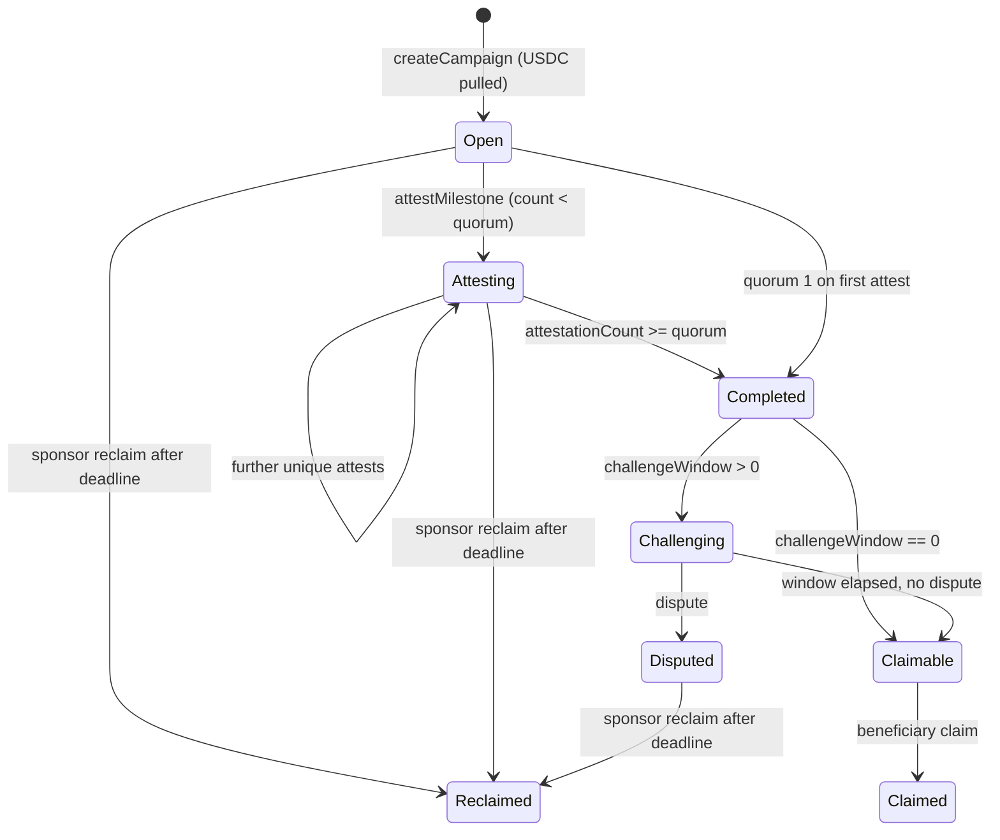

# Architecture

MileMark is a **v3** onchain USDC milestone escrow. The Solidity ABI is the source of truth. The Next.js app is a thin client: it reads `getCampaign` / `getMilestones` / `getAttestors` / `hasAttestedAll` and writes `createCampaign`, `attestMilestone`, `dispute`, `claim`, and `reclaim`. There is no indexer and no application database. The only backend in `web/` is a same-origin JSON-RPC proxy (`POST /rpc`).

This document is the canonical **contract + trust + lifecycle** guide. Frontend routes and modules: [`APP.md`](./APP.md). Deploy contracts + UI: [`DEPLOY.md`](./DEPLOY.md). Judge script: [`DEMO.md`](./DEMO.md).

## Live deploy (current)

| Item | Value |
|---|---|
| Product UI | https://milemark-pearl.vercel.app |
| Network | Arbitrum Sepolia (chain id `421614`) |
| MilestoneEscrow **v3** | [`0xC5A623f9204D3768DDce4aA34137b1eF75D7ADCC`](https://sepolia.arbiscan.io/address/0xC5A623f9204D3768DDce4aA34137b1eF75D7ADCC) |
| Deploy tx | [`0xf78262e4818c087d472c12ab7c9f3b02c316ef879bcb93ef8e9992692410e464`](https://sepolia.arbiscan.io/tx/0xf78262e4818c087d472c12ab7c9f3b02c316ef879bcb93ef8e9992692410e464) |
| Deploy block | `309949272` |
| Deployer | `0x3A17eD984f20C50C6927addDAEf633fff40f84D4` |
| USDC (Circle testnet) | `0x75faf114eafb1BDbe2F0316DF893fd58CE46AA4d` |
| Event `fromBlock` (UI) | `309949200` (safe start **before** deploy; do not use `309949351`) |
| Token assumption | 6 decimals, `SafeERC20` |

Frozen, ABI-incompatible predecessors — **never wire the UI**:

- v2 [`0xdECB21Fd8e835490E5B9Fc26469cE4Cca1F94207`](https://sepolia.arbiscan.io/address/0xdECB21Fd8e835490E5B9Fc26469cE4Cca1F94207)
- v1 `0x72b474DB34268281CD10db655cc1517C33973049`

v3 **is not an upgrade** of those addresses. It is a new immutable deploy.

## Product

**Problem.** Builder grants, hackathon prizes, and small retainers still settle on trust or a human escrow agent. A missed mile either blocks the next payment or dumps the whole purse.

**Who it is for.** A **sponsor** who will lock USDC, a **beneficiary** who delivers work, and one or more **attestors** who vote that a mile is done. Roles may overlap (live campaign `0` is 1-of-1 with the same address in all three seats — the original smoke exhibit; the live 2-of-3 exhibit is campaign `1`).

**Why onchain.** The split, the quorum, the challenge window, and the deadline reclaim are contract rules, not a spreadsheet. Anyone can verify balances and events on Arbiscan. The UI cannot invent a campaign that the contract does not store.

**Buildathon framing.** Arbitrum Open House Singapore Online Buildathon. Primary chain is **Arbitrum Sepolia** (testnet USDC). Stylus, Permit2, subgraphs, and mainnet are out of scope.

## Roles

| Role | How it is assigned | Writes | Cannot |
|---|---|---|---|
| **Sponsor** | `msg.sender` of `createCampaign` | `dispute` (during window), `reclaim` (after deadline) | Attest unless also listed; `claim` |
| **Beneficiary** | `createCampaign` argument | `claim` | Attest / dispute / reclaim unless they also hold those roles |
| **Attestor** | Unique addresses in `attestors[]` after skipping duplicates | `attestMilestone` once per mile; `dispute` during window | `claim` / `reclaim` unless they also hold those roles |
| **Stranger** | anyone else | none of the campaign writes | Everything campaign-specific (reverts `NotAttestor` / `NotDisputer` / …) |

Quorum is **N-of-M**: `1 <= quorum <= unique(attestors).length`, unique set capped at `MAX_ATTESTORS` (32). Duplicate attestors are skipped at create. Zero addresses revert.

**Dispute:** sponsor **or** any listed attestor, only while the mile is completed, not yet disputed, not reclaimed, and `block.timestamp < completedAt + challengeWindow`. Dispute is **sticky** (no onchain resolution) and **blocks claim forever** for that mile. After the campaign deadline the sponsor may reclaim that amount.

**Reclaim:** sponsor only, and only when `block.timestamp > deadline`. Pulls USDC still sitting on **incomplete or disputed** miles. Completed, undisputed, unclaimed amounts stay for the beneficiary (they become claimable when the window closes).

**Claim:** beneficiary only. Sum of miles that are completed, undisputed, unreclaimed, unclaimed, and whose window has elapsed (`challengeWindow == 0` ⇒ same timestamp as quorum).

## Lifecycle (per milestone)

Completion is **any-order**. Index 2 may complete before index 0. Descriptions are for humans; the contract does not enforce sequence.



Campaign-level flow:

1. Sponsor `approve`s USDC then `createCampaign(...)`. `sum(amounts)` is pulled in that transaction. Id is `campaignCount` before increment (first live id is `0`).
2. Each listed attestor may `attestMilestone(id, index, evidenceURI)` **once**. Empty evidence is valid. **First non-empty URI wins** (later URIs do not overwrite; empty never overwrites).
3. When `attestationCount >= quorum`, the contract latches `completed`, sets `completedAt`, emits `MilestoneAttested` then `MilestoneCompleted`.
4. During the window: sponsor or attestor may `dispute`. After the window with no dispute: beneficiary `claim`.
5. After `deadline`: sponsor `reclaim` leftover incomplete/disputed amounts.

A second `claim` with nothing new reverts `NothingToClaim`. Attesting a completed mile reverts `AlreadyCompleted`. Attesting a reclaimed mile reverts `AlreadyReclaimed`.

## Smart contract deep dive

File: `contracts/src/MilestoneEscrow.sol`. Solidity `^0.8.24`, OpenZeppelin `ReentrancyGuard` + `SafeERC20`. **Not upgradeable.** Constructor takes `usdc_` (non-zero) and stores it as `immutable`.

### Storage

| Slot / mapping | Shape | Notes |
|---|---|---|
| `usdc` | `IERC20 immutable` | Circle USDC on Sepolia; `MockERC20` in tests |
| `campaignCount` | `uint256` | Next id; also count of created campaigns |
| `campaigns[id]` | `Campaign` | `sponsor == address(0)` means unused id |
| `milestones[id][index]` | `Milestone` | Index-stable; `getMilestones` returns the full list |
| `isAttestor[id][account]` | `bool` | Unique set |
| `hasAttested[id][index][account]` | `bool` | One attest per attestor per mile |
| `_attestors[id]` | `address[]` | Insert order, duplicates omitted |

`Campaign`: `sponsor`, `beneficiary`, `deadline`, `challengeWindow`, `quorum`, `milestoneCount`, `createdAt`, `title`, `briefURI`.

`Milestone`: `description`, `evidenceURI`, `amount`, `completedAt`, `attestationCount`, `completed`, `claimed`, `reclaimed`, `disputed`.

`CampaignView` (read model): campaign fields plus live `claimable` and `reclaimable` computed from current `block.timestamp`.

### Public / external API

**Writes**

| Function | Guard | Token movement |
|---|---|---|
| `createCampaign(beneficiary, attestors, quorum, title, briefURI, deadline, challengeWindow, descriptions, amounts)` | `nonReentrant`; caller becomes sponsor | `safeTransferFrom` sponsor → contract for `sum(amounts)` |
| `attestMilestone(campaignId, index, evidenceURI)` | attestor, not completed/reclaimed, not already attested | none |
| `dispute(campaignId, index)` | sponsor or attestor; completed; in window | none |
| `claim(campaignId)` | `nonReentrant`; beneficiary | `safeTransfer` → beneficiary |
| `reclaim(campaignId)` | `nonReentrant`; sponsor; deadline passed | `safeTransfer` → sponsor |

**Reads**

| Function | Returns |
|---|---|
| `getCampaign(id)` | `CampaignView` (includes live claimable/reclaimable) |
| `getMilestones(id)` | `Milestone[]` |
| `getAttestors(id)` | unique attestor list |
| `hasAttestedAll(id, account)` | `bool[]` parallel to miles (zero address → all false) |
| `attestedBy(id, index)` | attestors who already voted, in list order |
| `claimableAmount(id)` / `reclaimableAmount(id)` | same math as the view fields |
| `campaigns` / `milestones` / `isAttestor` / `hasAttested` | public getters |
| `usdc`, `campaignCount`, `MAX_ATTESTORS` | constants / immutables |

The UI uses `getCampaign`, `getMilestones`, `getAttestors`, `hasAttestedAll`. It does **not** currently call `attestedBy` or the standalone amount getters (those values already sit on `CampaignView`).

### Events

```
CampaignCreated(campaignId, sponsor, beneficiary, totalAmount, deadline, quorum, challengeWindow)
MilestoneAttested(campaignId, index, attestor, evidenceURI, attestationCount, quorum)
MilestoneCompleted(campaignId, index, attestor, evidenceURI)  // attestor = caller who tipped quorum; URI = stored first-non-empty
MilestoneDisputed(campaignId, index, disputer)
Claimed(campaignId, beneficiary, amount)
Reclaimed(campaignId, sponsor, amount)
```

`CampaignCreated` indexes `(campaignId, sponsor, beneficiary)`. Activity timeline in the UI is `getContractEvents` from `ESCROW_FROM_BLOCK`, filtered by `campaignId`.

### Custom errors

`ZeroAddress`, `LengthMismatch`, `EmptyMilestones`, `EmptyAttestors`, `TooManyAttestors`, `InvalidQuorum`, `ZeroAmount`, `DeadlineInPast`, `CampaignNotFound`, `InvalidIndex`, `NotAttestor`, `NotBeneficiary`, `NotSponsor`, `NotDisputer`, `NotCompleted`, `AlreadyAttested`, `AlreadyCompleted`, `AlreadyDisputed`, `AlreadyReclaimed`, `ChallengeWindowClosed`, `NothingToClaim`, `NothingToReclaim`, `DeadlineNotPassed`.

`DeadlineInPast` is `deadline <= block.timestamp` at create (must be **strictly** in the future). `DeadlineNotPassed` is `block.timestamp <= deadline` at reclaim (deadline instant is **not** yet reclaimable).

### Invariants (`@custom:invariants`)

1. A mile is `completed` iff `attestationCount >= quorum` (latched once).
2. Each attestor may attest a given mile at most once (`hasAttested`).
3. Claimable iff `completed && !claimed && !disputed && !reclaimed && block.timestamp >= completedAt + challengeWindow`.
4. Dispute only by sponsor or attestor, only inside the window, sticky, never claimable afterwards.
5. After `block.timestamp > deadline`, sponsor may reclaim amounts that are **not** completed-and-undisputed. Completed undisputed amounts are never reclaimable — even if their challenge window is still open.
6. Attest / complete / dispute do not move tokens. Only create / claim / reclaim transfer USDC. `ReentrancyGuard` on those three.
7. `completed` and `reclaimed` are mutually exclusive after a successful reclaim of that index (`attest` then reverts `AlreadyReclaimed`).

### Security notes

- **Reentrancy.** Token transfers are the only external calls that move value. They sit behind `nonReentrant` on `createCampaign`, `claim`, and `reclaim`. Attest/dispute are view-storage-only (no token out).
- **SafeERC20.** USDC is treated as a possibly-non-standard ERC-20. Fee-on-transfer / rebasing tokens would desynchronize `amount` accounting — **not supported**. The contract assumes **6-decimal USDC**.
- **No allowlist on `title` / URIs.** Strings are unvalidated. `ipfs://` and `https://` are conventions; the contract does not fetch them.
- **Griefing.** Any attestor (or the sponsor) can dispute during the window and permanently block that mile’s claim. The economic backstop is sponsor reclaim after the deadline — not an onchain court.
- **Overlapping roles.** The contract does not forbid sponsor = beneficiary = attestor. Useful for demos; useless as a two-party check.
- **Immutability.** No proxy, no `owner`, no pause. Bugs require a **new address** (v4). Do not change live v3 function signatures, event topics, or error selectors.
- **`via_ir` + Cancun.** `contracts/foundry.toml`: `solc 0.8.24`, optimizer 200 runs, `via_ir = true`, `evm_version = "cancun"`.

### Historical ABI (do not call on v3)

v2 used a single-attestor-style `completeMilestone`. v3 **removed** that function. The current write is always `attestMilestone`. Quorum 1 is the closest equivalent to v2 “one listed attestor marks complete”.

## Frontend layers

Dependencies point inward. Domain code never imports wagmi, React, or Next. Details in [`APP.md`](./APP.md).

| Layer | Path | Depends on | Responsibility |
|---|---|---|---|
| Domain | `web/lib/milemark/` | stdlib only | Addresses, USDC 6-dec math, parse, roles, claim/reclaim/dispute reasons, quorum + window lifecycle, create validation, friendly errors |
| Contracts | `web/lib/contracts/` | domain address checks | Committed ABI + live/default addresses |
| Infra | `web/lib/chains.ts`, `web/lib/wagmi.ts`, `web/app/rpc`, `web/lib/config-guardrails.ts` | contracts | Chain defs, explorer URLs, wallet config, RPC proxy, non-blocking config warnings |
| Application | `web/hooks/use-campaign.ts` | contracts + wagmi | Campaign reads, parse, roles, refetch |
| Presentation | `web/components/{campaign,create,demo}/` | hooks + domain | Cards, forms, demo kit, Arbiscan tx feedback |
| Containers | `campaign-status.tsx`, `create-campaign-form.tsx` | presentation + hooks | Wire state; no extra parse/validation |
| Pages | `web/app/` | containers | `/`, `/create`, `/campaign/[id]`, `/demo`, `POST /rpc` |

## Trust model and limitations

**Guaranteed onchain (if you trust the bytecode at the v3 address and the token):**

- USDC pulled at create equals `sum(amounts)` (assuming standard ERC-20).
- Only listed attestors increment `attestationCount`; quorum latches completion.
- Claim and reclaim math as in invariants 3 and 5.
- Events are the audit trail.

**Not guaranteed:**

- **Attestor honesty.** Quorum is a set of EOAs/contracts, not an oracle of “work done”.
- **URI content.** `briefURI` / `evidenceURI` are strings. IPFS/HTTPS payloads can change, rot, or require a gateway. The UI maps `ipfs://` → `https://ipfs.io/ipfs/…` for clicks; that gateway is not consensus.
- **Sticky dispute** is a veto, not arbitration.
- **No indexer.** Timeline quality depends on the RPC `getLogs` range (`fromBlock` must be ≤ the create block). Some Arb Sepolia providers reject `fromBlock 0` or huge ranges — prefer a start just before deploy (canonical live v3: `309949200`).
- **UI RPC.** Browsers talk to `POST /rpc`, which forwards to `NEXT_PUBLIC_RPC`. A lying RPC can show a stale or fake read; writes still hit the chain the wallet is on.
- **No offchain DB.** If the UI is down, the contract still holds funds. If `fromBlock` is too high, the activity feed looks empty even when miles exist (reads via `getCampaign` still work).

## ABI freeze

Do not change function signatures, event topics, or error selectors on the **live** v3 address. NatSpec and UI refactors are the expected follow-ups unless a **v4** is deployed to a new address. Leave v1/v2 untouched.
